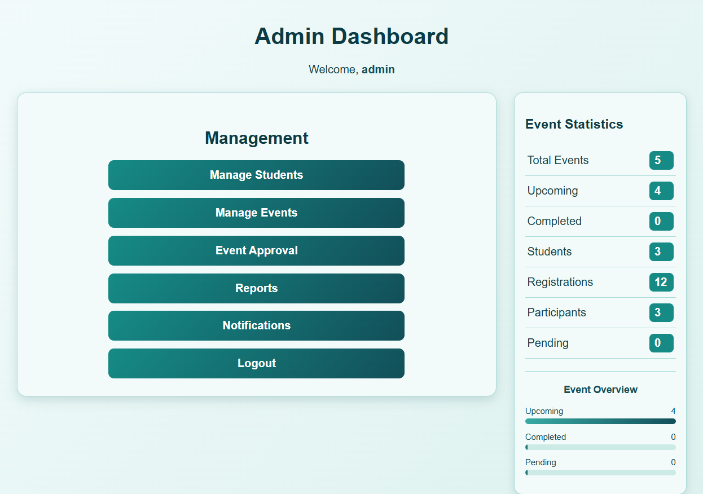
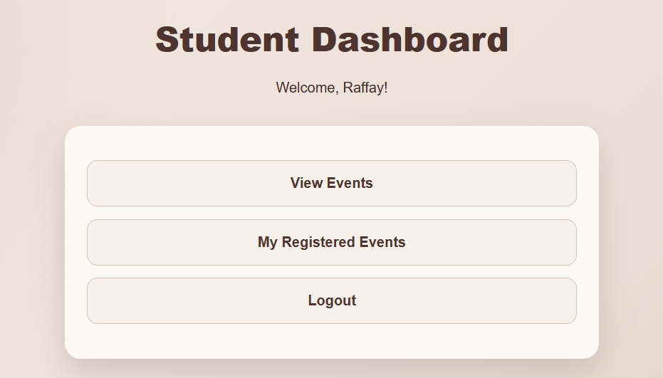
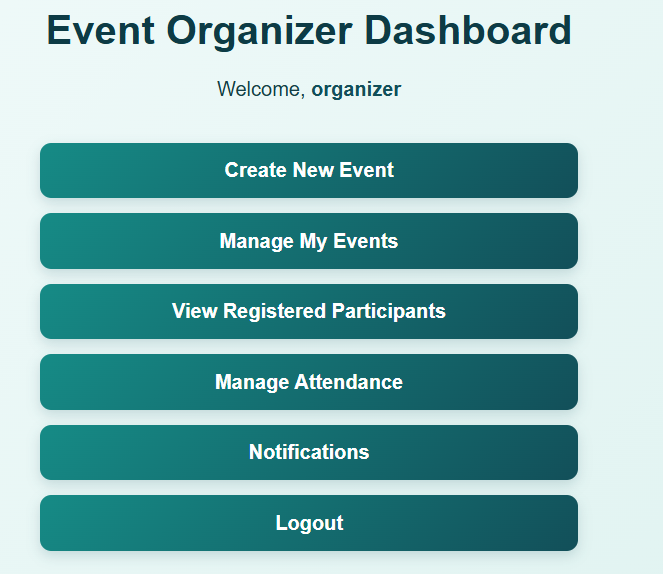
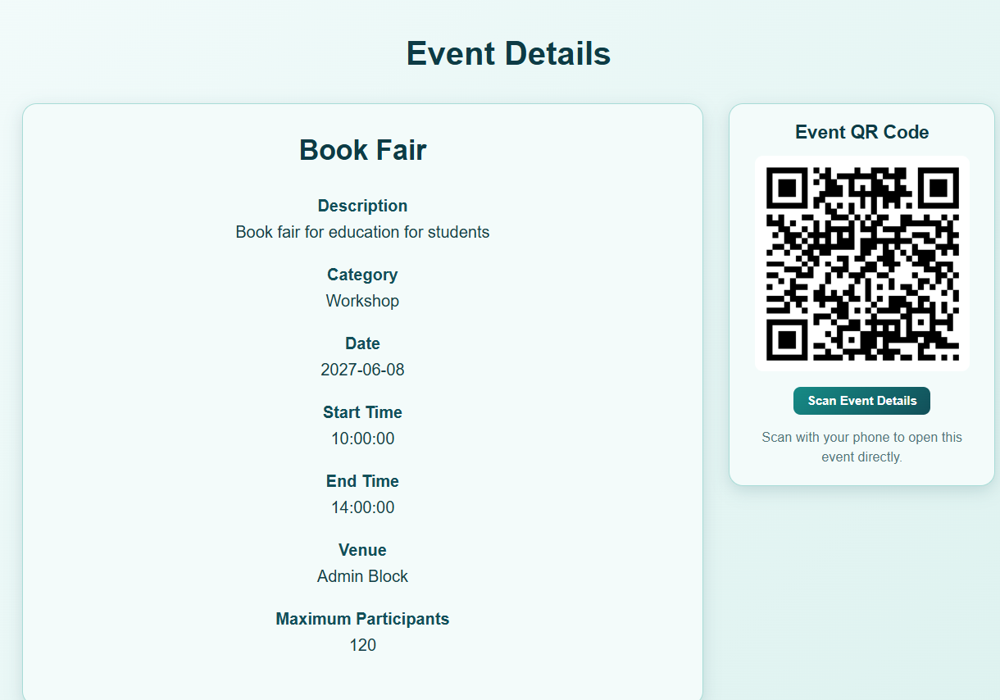
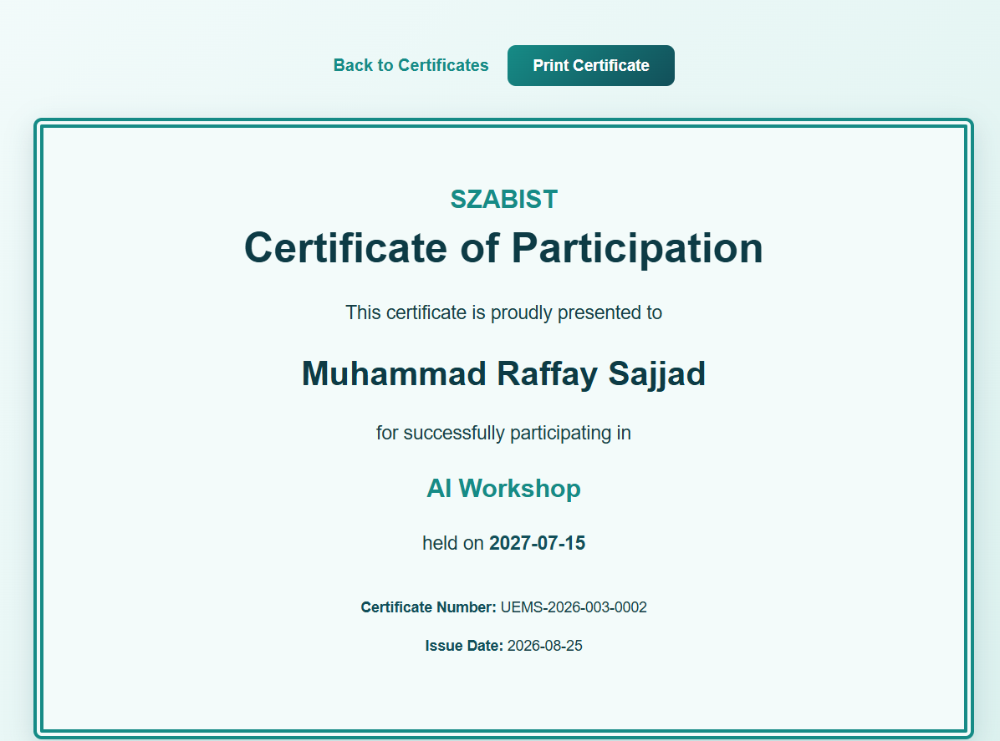

# 🎓 University Event Management System

A web-based **University Event Management System (UEMS)** developed using PHP, MySQL, HTML, CSS, and JavaScript.

The system provides separate dashboards for **Admin, Organizer, and Student** users and includes event management, registration, attendance, reports, notifications, certificates, and QR-based event access.

---

## 🌐 Live Website

👉 https://eventmanage.infy.click

---

# 📸 Project Screenshots

## 🔐 Admin Dashboard

The Admin Dashboard provides an overview of the University Event Management System and allows the administrator to manage students, events, event approvals, and reports.



---

## 🎓 Student Dashboard

The Student Dashboard allows students to browse available events, register for events, check their registered events, view reports, notifications, and certificates.



---

## 📅 Organizer Dashboard

The Organizer Dashboard allows organizers to create and manage events, view participants, manage attendance, send reminders, and monitor their events.



---

## 📱 QR Code Event Access

Approved events include a QR code that can be scanned using a mobile phone.

The QR code opens the public event information page, allowing users to quickly view the event details.



---

## 🏆 Participation Certificate

Students who are marked **Present** in an event can receive a participation certificate.

The certificate contains the student's information, event information, certificate number, and issue date.



---

# 💻 Technologies Used

- PHP
- MySQL
- HTML5
- CSS3
- JavaScript
- phpMyAdmin
- InfinityFree Hosting
- Git
- GitHub

---

# 👥 User Roles

## 🔐 Admin

Admin can:

- Login to the Admin Dashboard
- Add students
- Edit students
- Delete students
- Add events
- Edit events
- Delete events
- Approve organizer events
- Reject organizer events
- View dashboard statistics
- View registration reports
- View attendance reports
- Filter reports
- Manage the overall system

---

## 📅 Organizer

Organizer can:

- Login to the Organizer Dashboard
- Create new events
- View their events
- Edit their own events
- Cancel events
- View registered participants
- Mark attendance
- Mark students Present or Absent
- Send event reminders
- View notifications

Organizer-created events require **Admin approval** before they are visible to students.

---

## 🎓 Student

Students can:

- Login to the Student Dashboard
- Browse approved events
- Search available events
- View event details
- Register for events
- Cancel registration
- View registered events
- View participation reports
- Receive notifications
- View certificates
- Access events using QR codes

---

# ✅ Main Features

- Role-based authentication
- Admin Dashboard
- Organizer Dashboard
- Student Dashboard
- Student management
- Event management
- Event approval and rejection
- Student event registration
- Duplicate registration prevention
- Maximum participant control
- Attendance management
- Present / Absent attendance status
- Dashboard statistics
- Reports and filtering
- Notifications
- Event reminders
- Participation certificates
- QR code event access
- Public event information page
- Responsive interface
- MySQL database integration
- Online deployment

---

# 📊 Reports

The system provides multiple reports including:

- Event-wise registration reports
- Student participation reports
- Attendance reports
- Present / Absent reports

Reports can be filtered using:

- Event
- Date
- Department
- Student

---

# 📱 QR Code Feature

Each approved event can display a QR code.

When the QR code is scanned, the user is taken to the public event information page.

This allows event information to be accessed directly from a mobile phone without manually entering the website address.

---

# 🏆 Certificate Feature

Students who attend an event and are marked:

```text
Present
```

can receive a participation certificate.

The certificate includes:

- Student Name
- Student Information
- Event Name
- Certificate Number
- Issue Date

The certificate can also be viewed and printed from the Student Dashboard.

---

# 🗂️ Project Structure

```text
UniversityEventSystem/
│
├── admin/
│   ├── add_event.php
│   ├── add_student.php
│   ├── approve_event.php
│   ├── dashboard.php
│   ├── delete_event.php
│   ├── delete_student.php
│   ├── edit_event.php
│   ├── edit_student.php
│   ├── event_approval.php
│   ├── events.php
│   ├── reject_event.php
│   ├── reports.php
│   └── students.php
│
├── organizer/
│   ├── attendance.php
│   ├── cancel_event.php
│   ├── create_event.php
│   ├── dashboard.php
│   ├── edit_event.php
│   ├── event_participants.php
│   ├── mark_attendance.php
│   ├── my_events.php
│   ├── participants.php
│   ├── send_reminder.php
│   └── view_event.php
│
├── student/
│   ├── cancel_registration.php
│   ├── certificates.php
│   ├── dashboard.php
│   ├── event_details.php
│   ├── events.php
│   ├── register.php
│   ├── registered_events.php
│   ├── reports.php
│   └── view_certificate.php
│
├── config/
│   ├── database.example.php
│   └── session.php
│
├── css/
│   └── style.css
│
├── screenshots/
│   ├── admin-dashboard.png
│   ├── student-dashboard.png
│   ├── organizer-dashboard.png
│   ├── qr-code.png
│   └── certificate.png
│
├── database_schema.sql
├── index.php
├── login.php
├── logout.php
├── notifications.php
├── public_event.php
└── README.md
```

---

# ⚙️ Local Installation

## 1. Clone the Repository

```bash
git clone https://github.com/raffay985/University-Event-Management-System.git
```

Enter the project folder:

```bash
cd University-Event-Management-System
```

---

## 2. Create the MySQL Database

Create a database named:

```text
university_event_system
```

Import:

```text
database_schema.sql
```

This creates the required database tables.

---

## 3. Configure the Database

Inside the:

```text
config
```

folder, use:

```text
database.example.php
```

as a template and create:

```text
database.php
```

Enter your own MySQL credentials.

Example:

```php
<?php

$host = "localhost";
$username = "YOUR_MYSQL_USERNAME";
$password = "YOUR_MYSQL_PASSWORD";
$database = "university_event_system";

$conn = new mysqli(
    $host,
    $username,
    $password,
    $database
);

if ($conn->connect_error) {
    die("Database connection failed: " . $conn->connect_error);
}

$conn->set_charset("utf8mb4");

?>
```

---

## 4. Start the PHP Server

Run:

```bash
php -S localhost:8000
```

Then open:

```text
http://localhost:8000
```

---

# 🔒 Security

Real MySQL database credentials are **not uploaded to GitHub**.

The real file:

```text
config/database.php
```

is excluded using `.gitignore`.

A safe example is provided:

```text
config/database.example.php
```

The repository also contains:

```text
database_schema.sql
```

which contains the database structure without the private production database credentials.

---

# 🚀 Deployment

The University Event Management System is deployed online using **InfinityFree PHP/MySQL Hosting**.

### Live Website

👉 https://eventmanage.infy.click

### GitHub Repository

👉 https://github.com/raffay985/University-Event-Management-System

---

# 🎯 Project Purpose

This project was developed as a **Web Engineering university project** to demonstrate:

- PHP web development
- HTML and CSS frontend development
- MySQL database integration
- Authentication
- Role-based access control
- CRUD operations
- Student management
- Event management
- Event approval workflow
- Event registration
- Attendance management
- Reports
- Notifications
- Certificates
- QR code integration
- Online PHP/MySQL deployment
- Git and GitHub version control

---

# 👨‍💻 Author

**Muhammad Raffay Sajjad**

GitHub: https://github.com/raffay985

---

# 📄 License

This project was developed for educational purposes.